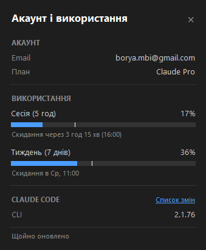

🇬🇧 [English](README.md)

# Usage Monitor for Claude

**Відстежуйте ліміти використання Claude у реальному часі - прямо з системного трея Windows.**

Нативний додаток для Windows, який показує ваше використання Claude з першого погляду - легкий, портативний та повністю відкритий для аудиту. Ліміти використання спільні для claude.ai, Claude Code та розширень для IDE (VS Code та JetBrains) - завжди знайте, скільки часу сесії та тижневого ліміту у вас залишилося.



## Функції

- **Портативний** - один EXE файл (~20 МБ), без встановлення, без Electron, без сторонніх середовищ виконання. Завантажте, розмістіть де завгодно, запустіть
- **Нульова конфігурація** - автентифікація через ваш існуючий логін Claude Code. Без ключів API, без ручного введення токенів
- **Жива іконка в треї** з двома прогрес-барами (сесія + тиждень), відображення відсотків при високому використанні, та кольори, що підлаштовуються під світлу або темну теми панелі завдань
- **Детальна статистика** (лівий клік) показує інформацію про акаунт, прогрес-бари для всіх типів квот (Сесія, Тиждень, Sonnet, Opus, додаткове використання), зворотний відлік до скидання, встановлені версії Claude Code та свіжість даних
- **Маркер часу** на кожній смужці - біла лінія, що показує час, який минув у поточному періоді. Ви одразу бачите, чи випереджаєте ви ліміт, чи використовуєте Claude повільніше за плин часу
- **Розумні сповіщення** - настроювані пороги для кожного типу квоти, з режимом врахування часу, який сповіщає лише тоді, коли використання випереджає графік. Сповіщення про скидання, коли майже вичерпана квота поповнюється
- **Команди подій** - запуск власної команди оболонки (shell), коли квота скидається або досягається поріг використання. Надсилайте push-сповіщення, запускайте скрипти або будь-які власні робочі процеси
- **Автоматичне оновлення токена** - коли сесія OAuth закінчується, у фоновому режимі запускається `claude update` для оновлення токена без втручання користувача. Якщо встановлено CLI-оновлення, показується сповіщення
- **Версії Claude Code** - вікно статистики показує встановлені версії Claude Code (CLI, VS Code, Cursor, Windsurf), щоб ви завжди знали, яку версію використовує кожне середовище
- **Адаптивне опитування** - прискорюється під час активного використання, зупиняється, коли комп'ютер не використовується або заблокований.
- **Точність таймінгу (Reset-Aware Polling)** - унікальна фіча цієї гілки: додаток точно розраховує час скидання квоти та перериває режим бездіяльності (idle pause), щоб команди спрацювали точно в момент скидання, навіть якщо комп'ютер заблокований
- **Багатомовна підтримка**: доступно 13 мовами (англійська, німецька, іспанська, французька, хінді, індонезійська, італійська, японська, корейська, португальська, українська та китайська)
- **Настроювання** - можливість змінити інтервали опитування, кольори, пороги сповіщень та інше через [JSON-файл налаштувань](#configuration)

---

## Безпека та прозорість

Цей інструмент працює з вашим OAuth-токеном Claude Code, тому ви повинні мати змогу переконатися в його безпеці. Код структурований для легкого аудиту:

- **Єдиний мережевий напрямок** - спілкується виключно з `api.anthropic.com`, жодних інших хостів
- **Облікові дані залишаються локально** - OAuth-токен використовується лише в HTTP-заголовках Authorization, ніколи не логується, не зберігається в інших місцях і не передається третім сторонам
- **Тільки для читання** - додаток ніколи не записує файли на диск
- **Жодного динамічного виконання коду** - без `eval()`, `exec()`, `compile()` або динамічних імпортів
- **Без обфускації** - немає закодованих рядків, прихованих URL або зашифрованої логіки
- **Модульна архітектура** - невеликі, фокусовані модулі. Критично важливий код (облікові дані, виклики API) ізольовано в одному файлі ([`api.py`](usage_monitor_for_claude/api.py))
- **Мінімальні залежності** - лише три відомі пакети: [requests](https://pypi.org/project/requests/), [Pillow](https://pypi.org/project/pillow/), [pystray](https://pypi.org/project/pystray/)

---

## Вимоги

- **Windows 10 або Windows 11** (64-біт)
- **[Claude Code](https://docs.anthropic.com/en/docs/claude-code)** встановлений та авторизований (CLI, розширення VS Code або плагін JetBrains - підійде будь-який варіант). Додаток зчитує OAuth-токен, який Claude Code зберігає локально (`~/.claude/.credentials.json`).

> [!TIP]
> Якщо термін дії токена закінчується, додаток автоматично запускає `claude update` для його оновлення. Якщо токен відсутній взагалі, додаток покаже сповіщення та іконку "!" - просто увійдіть у Claude Code, і монітор підхопить його автоматично.

---

## Швидкий старт

**Python не потрібен.** Завантажте останню версію [**UsageMonitorForClaude.exe**](https://github.com/jens-duttke/usage-monitor-for-claude/releases/latest), розмістіть його де завгодно та запустить. Щоб видалити, спочатку вимкніть "Start with Windows" у контекстному меню (якщо ввімкнено), а потім видаліть файл.

---

## Як користуватися

| Дія | Що відбувається |
|---|---|
| **Навести** на іконку в треї | Підказка показує відсотки використання за 5 год та 7 днів з часом скидання |
| **Лівий клік** на іконку | Відкриває вікно статистики з інфо про акаунт та всіма смужками використання |
| **Правий клік** на іконку | Контекстне меню: відкрити статистику, автозавантаження, тестувати команди, перезапустити або вихід |
| **Escape** або клік зовні | Закриває вікно статистики |

### Іконка в треї не відображається?

Windows може приховувати нові іконки за замовчуванням. Щоб іконка була завжди видимою:

1. Правий клік на **панелі завдань** -> **Налаштування панелі завдань**
2. Розгорніть **Інші іконки системного трея** (Win 11) або **Виберіть іконки, що відображаються на панелі завдань** (Win 10)
3. Увімкніть перемикач для **UsageMonitorForClaude**

### Як читати прогрес-бари

Кожна смужка у вікні статистики має до трьох візуальних елементів:

1. **Синє заповнення** - скільки ліміту ви вже використали
2. **Біла вертикальна лінія** - скільки *часу* минуло в поточному періоді. Колір стає **червоним**, коли використання проходить цей маркер, попереджаючи про ризик вичерпати ліміт раніше часу.
3. **Текст скидання** - коли ліміт буде оновлено (зворотний відлік з часом на годиннику)

---

## Налаштування

Додаток використовує `usage-monitor-settings.json` для конфігурації. Детальніше про всі доступні параметри (пороги сповіщень, інтервали опитування, кольори, мову тощо) читайте в [документації з налаштування](docs/configuration.md) (наразі англійською).

Основні ключі для команд:
- `on_reset_command` — команда при скиданні.
- `on_threshold_command` — команда при досягненні порогу.

> [!TIP]
> Команди виконуються у робочій директорії програми **без створення консольного вікна**. Ви можете розмістити власні скрипти (наприклад, [`claude_reset_hook.ps1`](claude_reset_hook.ps1)) та файл [`.env`](.env.example) безпосередньо поруч із портативним EXE-файлом.

---

## Збірка з коду

<details>
<summary>Для розробників, які хочуть зібрати EXE самостійно</summary>

### Попередні вимоги

- Python 3.10+
- pip

### Налаштування

> [!IMPORTANT]
> Усі Python-команди (запуск програми, запуск тестів або побудова EXE) **повинні** виконуватися у віртуальному середовищі.

```bash
git clone https://github.com/jens-duttke/usage-monitor-for-claude.git
cd usage-monitor-for-claude
# Створення та активація venv
if (!(Test-Path .\venv)) { python -m venv venv }
.\venv\Scripts\activate
# Встановлення залежностей
pip install -r requirements.txt
```

### Запуск

```bash
python -m usage_monitor_for_claude
```

### Збірка EXE

```bash
python build.py
```

Створює `dist/UsageMonitorForClaude.exe` (~20 МБ) - єдиний файл, що містить Python та всі залежності.

### Створення релізу

1. Оновіть залежності: `pip install --upgrade -r requirements.txt`
2. Оновіть `__version__` у [`usage_monitor_for_claude/__init__.py`](usage_monitor_for_claude/__init__.py) та версію у [`version_info.py`](version_info.py) (`filevers`, `prodvers`, `FileVersion`, `ProductVersion`)
3. У [`CHANGELOG.md`](CHANGELOG.md) перейменуйте `## [Unreleased]` на `## [1.x.x] - YYYY-MM-DD` та додайте свіжий порожній розділ `## [Unreleased]` зверху
4. Запустіть тести: `python -m unittest discover -s tests`
5. Тестування: `python -m usage_monitor_for_claude` - перевірте іконку, вікно статистики та налаштування
6. Зберіть EXE командою `python build.py`
7. Тестування EXE: `dist/UsageMonitorForClaude.exe` - перевірте працездатність
8. Коміт, тег, пуш та публікація:

   ```bash
   git add -A && git commit -m "Release v1.x.x"
   git tag v1.x.x
   git push origin main v1.x.x
   gh release create v1.x.x dist/UsageMonitorForClaude.exe --title "v1.x.x" --notes "<release notes from CHANGELOG.md>"
   ```

</details>

---

## Ліцензія

MIT

---

## Дисклеймер

Це незалежний проєкт, створений спільнотою. Він **не** створений, не схвалений і не підтримується офіційно компанією [Anthropic](https://www.anthropic.com/). "Claude" та "Anthropic" are trademarks of Anthropic, PBC. Використання цих назв є виключно описовим для вказівки на сумісність.
